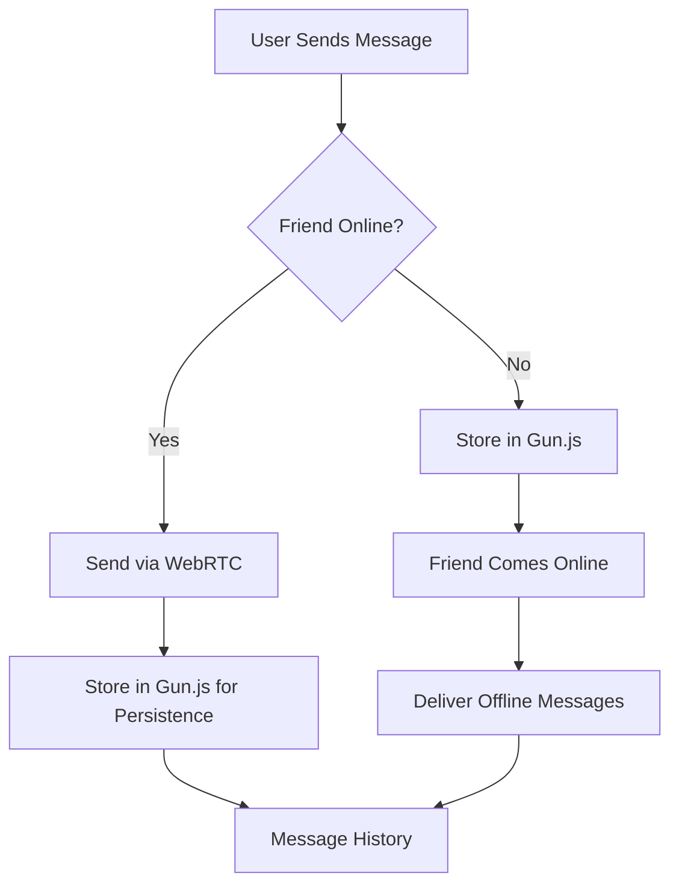

# 📊 Data Management in Whisperz

## Overview

Whisperz uses a **hybrid approach** combining WebRTC for real-time messaging and Gun.js for persistent data storage. This ensures messages are delivered instantly when both users are online, while also providing offline message delivery and permanent storage.

## 🗄️ Data Storage Architecture

### 1. **Gun.js - Distributed Database**

Gun.js is the primary data persistence layer, providing:
- **Decentralized storage** across multiple relay servers
- **Real-time synchronization** between peers
- **Offline-first capability** with local caching
- **Encrypted data storage** using Gun.SEA

#### Configuration
```javascript
// Gun.js initialization (gunAuthService.js)
this.gun = Gun({
  peers: [/* relay servers */],
  localStorage: true,      // Enable local storage
  radisk: true,           // Enable IndexedDB for larger data
  sessionStorage: true    // Session persistence
});
```

### 2. **Local Storage Mechanisms**

#### **localStorage**
- User preferences
- Theme settings
- Last read timestamps for conversations
- Dev tools settings

#### **sessionStorage**
- Temporary authentication state
- Active session data

#### **IndexedDB (via RadixDB)**
- Large message history
- Cached user data
- Offline message queue
- Media/file storage

## 📨 Message Management

### Message Flow



### Message Storage Structure

#### 1. **Real-time Messages (WebRTC)**
```javascript
// Direct P2P transmission
{
  id: "msg_timestamp_random",
  content: "encrypted_content",
  from: "sender_public_key",
  to: "recipient_public_key",
  timestamp: 1234567890,
  deliveryMethod: "webrtc",
  delivered: true
}
```

#### 2. **Persistent Messages (Gun.js)**
```javascript
// Stored in Gun.js database
gun.get('conversations')
   .get(conversationId)
   .get('messages')
   .get(messageId)
   .put({
     content: "encrypted_content",
     from: "sender_public_key",
     to: "recipient_public_key",
     timestamp: 1234567890,
     delivered: false,
     storedAt: 1234567890
   });
```

### Message Encryption

All messages are encrypted using **Gun.SEA** (Security, Encryption, Authorization):

```javascript
// Encryption for specific recipient
const encrypted = await gun.SEA.encrypt(message, recipientPublicKey);

// Decryption by recipient
const decrypted = await gun.SEA.decrypt(encrypted, myKeyPair);
```

## 👤 User Data Management

### User Profile Structure

```javascript
user.get('profile').put({
  nickname: "User Display Name",
  username: "unique_username",
  publicKey: "SEA_public_key",
  createdAt: timestamp,
  avatar: "base64_image_data", // optional
  status: "online/offline/away"
});
```

### Authentication Data

- **Public Key**: Used for identity and encryption
- **Private Key**: Stored encrypted in localStorage
- **Session Token**: Temporary auth in sessionStorage

## 👥 Friends & Contacts

### Friend Data Structure

```javascript
user.get('friends').get(friendPublicKey).put({
  nickname: "Friend Name",
  publicKey: "friend_public_key",
  addedAt: timestamp,
  conversationId: "unique_conversation_id",
  sharedSecret: "encrypted_shared_key"
});
```

### Presence Management

```javascript
gun.get('presence').get(userPublicKey).put({
  status: "online",
  lastSeen: timestamp,
  peerId: "webrtc_peer_id",
  webrtcEnabled: true
});
```

## 🔄 Data Synchronization

### Multi-Device Sync

Gun.js automatically synchronizes data across devices:

1. **User logs in on new device**
2. **Gun.js fetches data from relay servers**
3. **Local cache is populated**
4. **Real-time updates via WebSocket**

### Conflict Resolution

Gun.js uses **CRDT** (Conflict-free Replicated Data Types):
- Last-write-wins for simple values
- Merge strategies for complex objects
- Automatic conflict resolution

## 💾 Offline Capabilities

### Offline Message Queue

```javascript
// Store offline message
hybridGunService.storeOfflineMessage(recipientPub, {
  content: encrypted_message,
  timestamp: Date.now(),
  delivered: false
});

// Check and deliver when online
const offlineMessages = await hybridGunService.getOfflineMessages();
offlineMessages.forEach(msg => deliver(msg));
```

### Service Worker (Future Enhancement)

```javascript
// Cache strategies for offline access
self.addEventListener('fetch', event => {
  event.respondWith(
    caches.match(event.request)
      .then(response => response || fetch(event.request))
  );
});
```

## 🗑️ Data Cleanup & Management

### Message Retention

```javascript
// Clear old messages (optional)
const ONE_MONTH = 30 * 24 * 60 * 60 * 1000;
const cutoff = Date.now() - ONE_MONTH;

gun.get('conversations')
   .get(conversationId)
   .get('messages')
   .map()
   .once((msg, key) => {
     if (msg.timestamp < cutoff) {
       gun.get('conversations')
          .get(conversationId)
          .get('messages')
          .get(key)
          .put(null); // Delete
     }
   });
```

### Storage Limits

| Storage Type | Limit | Usage |
|-------------|-------|-------|
| localStorage | 5-10 MB | Settings, keys |
| sessionStorage | 5-10 MB | Temp data |
| IndexedDB | 50% of free disk | Messages, media |
| Gun.js Cloud | Unlimited* | All data |

*Limited by relay server capacity

## 🔍 Data Access Patterns

### Reading Messages

```javascript
// Get conversation history
const messages = await hybridGunService.getMessageHistory(
  conversationId, 
  limit = 50
);

// Subscribe to new messages
hybridGunService.subscribeToConversation(conversationId, (msg) => {
  console.log('New message:', msg);
});
```

### Writing Messages

```javascript
// Send message (hybrid approach)
await messageService.sendMessage(
  recipientPublicKey,
  content,
  metadata
);
```

## 🔐 Security Considerations

### Data Protection

1. **End-to-End Encryption**: All messages encrypted with recipient's public key
2. **Local Encryption**: Sensitive data encrypted before localStorage
3. **HTTPS Only**: All network communication over TLS
4. **Key Management**: Private keys never transmitted

### Privacy Features

- No central server has access to message content
- Peer-to-peer architecture minimizes data exposure
- Optional message expiration
- User-controlled data deletion

## 📊 Performance Optimization

### Caching Strategy

```javascript
// LRU cache for messages
class MessageCache {
  constructor(maxSize = 1000) {
    this.cache = new Map();
    this.maxSize = maxSize;
  }
  
  get(key) {
    const value = this.cache.get(key);
    if (value) {
      // Move to end (most recently used)
      this.cache.delete(key);
      this.cache.set(key, value);
    }
    return value;
  }
  
  set(key, value) {
    if (this.cache.size >= this.maxSize) {
      // Remove least recently used
      const firstKey = this.cache.keys().next().value;
      this.cache.delete(firstKey);
    }
    this.cache.set(key, value);
  }
}
```

### Lazy Loading

```javascript
// Load messages on demand
async function loadMessages(conversationId, page = 1) {
  const pageSize = 50;
  const offset = (page - 1) * pageSize;
  
  return await hybridGunService.getMessageHistory(
    conversationId,
    pageSize,
    offset
  );
}
```

## 🚀 Best Practices

### Do's ✅

1. **Always encrypt sensitive data**
2. **Use pagination for large datasets**
3. **Implement proper error handling**
4. **Clean up old data periodically**
5. **Cache frequently accessed data**
6. **Use WebRTC for real-time when possible**

### Don'ts ❌

1. **Don't store passwords in plain text**
2. **Don't rely solely on client-side validation**
3. **Don't store large files in Gun.js directly**
4. **Don't ignore storage quotas**
5. **Don't skip encryption for "performance"**

## 📈 Monitoring & Analytics

### Storage Usage

```javascript
// Check storage usage
async function getStorageUsage() {
  if (navigator.storage && navigator.storage.estimate) {
    const estimate = await navigator.storage.estimate();
    return {
      usage: estimate.usage,
      quota: estimate.quota,
      percentage: (estimate.usage / estimate.quota) * 100
    };
  }
}
```

### Performance Metrics

```javascript
// Track message delivery time
const startTime = performance.now();
await messageService.sendMessage(recipient, content);
const deliveryTime = performance.now() - startTime;
console.log(`Message delivered in ${deliveryTime}ms`);
```

## 🔄 Data Migration

### Version Upgrades

```javascript
// Handle data schema changes
async function migrateData(fromVersion, toVersion) {
  if (fromVersion < 2 && toVersion >= 2) {
    // Migrate to new message format
    const oldMessages = await getOldMessages();
    for (const msg of oldMessages) {
      await storeNewFormat(transformMessage(msg));
    }
  }
}
```

## 📚 Related Documentation

- [Gun.js Documentation](https://gun.eco/docs/)
- [WebRTC API](https://developer.mozilla.org/en-US/docs/Web/API/WebRTC_API)
- [IndexedDB API](https://developer.mozilla.org/en-US/docs/Web/API/IndexedDB_API)
- [Web Crypto API](https://developer.mozilla.org/en-US/docs/Web/API/Web_Crypto_API)